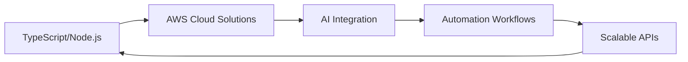

# 👋 Hello, I'm Şamil Cihat

<div align="center">
  
[](https://git.io/typing-svg)

</div>

---

## 🚀 About Me


```typescript
interface Developer {
  name: string;
  role: string;
  location: string;
  currentFocus: string[];
  specialties: string[];
  passion: string;
}

const developer: Developer = {
  name: "Şamil Cihat Demir",
  role: "Full Stack Developer & AI Enthusiast",
  location: "Turkey 🇹🇷",
  currentFocus: ["TypeScript", "Node.js", "AWS Cloud", "AI Integration"],
  specialties: ["Automation Workflows", "Cloud Architecture", "AI Tools Development"],
  passion: "Building intelligent, scalable solutions with cutting-edge technology"
};
```

- 🔭 **Currently working on:** Advanced TypeScript/Node.js applications with AI integration
- 🤖 **AI & Automation:** Developing intelligent workflows with **n8n** and AI tools
- ☁️ **Cloud Expertise:** Building scalable solutions on **AWS** infrastructure
- 🌱 **Learning:** Advanced AI/ML integration, Serverless architectures, Cloud-native development
- 💡 **Focus Areas:** TypeScript ecosystems, Microservices, AI-powered automation
- 📫 **Reach me:** [LinkedIn](https://www.linkedin.com/in/samilcdemir/) | [Email](mailto:samilcd.26@example.com)

<br clear="both">

---

## 🛠️ Technology Stack

<div align="center">

### 🎯 Core Technologies
[](https://www.typescriptlang.org/)
[](https://nodejs.org/)
[](https://developer.mozilla.org/en-US/docs/Web/JavaScript)

### ☁️ Cloud & Infrastructure (AWS Focus)
[](https://aws.amazon.com/)
[](https://aws.amazon.com/lambda/)
[](https://aws.amazon.com/ec2/)
[](https://aws.amazon.com/s3/)
[](https://aws.amazon.com/rds/)

### 🤖 AI & Automation Tools
[](https://n8n.io/)
[](https://openai.com/)
[](https://claude.ai/)
[](https://zapier.com/)

### 🎨 Frontend Development
[](https://reactjs.org/)
[](https://nextjs.org/)
[](https://vuejs.org/)
[](https://angular.io/)

[](https://tailwindcss.com/)
[](https://mui.com/)

### ⚙️ Backend & API Development
[](https://expressjs.com/)
[](https://www.fastify.io/)
[](https://nestjs.com/)
[](https://graphql.org/)
[](https://restfulapi.net/)

### 🗄️ Databases & Storage
[](https://www.mongodb.com/)
[](https://www.postgresql.org/)
[](https://www.mysql.com/)
[](https://redis.io/)

### 📱 Mobile & Cross-Platform
[](https://reactnative.dev/)
[](https://flutter.dev/)
[](https://www.electronjs.org/)

### 🛠️ DevOps & Tools
[](https://www.docker.com/)
[](https://kubernetes.io/)
[](https://github.com/features/actions)
[](https://www.terraform.io/)

</div>

---

## 🌟 Featured Projects & Expertise

<div align="center">

### 🚀 **Current Focus Areas**



</div>

- **🤖 AI-Powered Automation:** Creating intelligent workflows using **n8n**, OpenAI API, and Claude AI
- **☁️ AWS Architecture:** Serverless applications, microservices, and cloud-native solutions
- **⚡ TypeScript Ecosystems:** Advanced type systems, decorators, and modern JavaScript patterns
- **🔗 API Development:** RESTful and GraphQL APIs with robust architecture patterns
- **📊 Data Processing:** Real-time data pipelines and AI-enhanced analytics

---

## 📊 GitHub Analytics

<div align="center">
  
<table width="100%">
  <tr>
    <td width="50%">
      
    </td>
    <td width="50%">
      
    </td>
  </tr>
  <tr>
    <td colspan="2" align="center">
      
    </td>
  </tr>
</table>

### 🏆 GitHub Trophies
<div align="center">

</div>

### 🐍 Contribution Graph
<picture>
  <source media="(prefers-color-scheme: dark)" srcset="https://raw.githubusercontent.com/platane/platane/output/github-contribution-grid-snake-dark.svg">
  <source media="(prefers-color-scheme: light)" srcset="https://raw.githubusercontent.com/platane/platane/output/github-contribution-grid-snake.svg">
  
</picture>

</div>

---

## 🏆 Coding Profiles & Achievements

<div align="center">

[](https://www.leetcode.com/Samilcd26/)
[](https://www.hackerrank.com/samilcd_26)
[](https://stackoverflow.com/users/youruserid)

</div>

---

## 🤝 Let's Connect & Collaborate

<div align="center">

**Open to collaborating on:**
- 🚀 TypeScript/Node.js projects
- ☁️ AWS cloud solutions
- 🤖 AI integration and automation tools
- 📱 Full-stack applications
- 🔧 Open source contributions

[](https://www.linkedin.com/in/samilcdemir/)
[](https://twitter.com/Samilcd26)
[](https://medium.com/@samilcd.26)
[](https://www.instagram.com/samilcd.26/?hl=tr)
[](https://github.com/Samilcd26)

</div>

---

<div align="center">
  
**💡 "Building the future with TypeScript, AI, and Cloud Technologies"**


⭐️ Crafted with ❤️ and ☕ by [Samilcd26](https://github.com/Samilcd26)

---

**"Code is poetry written in logic, AI is the muse that inspires innovation."**

</div>
